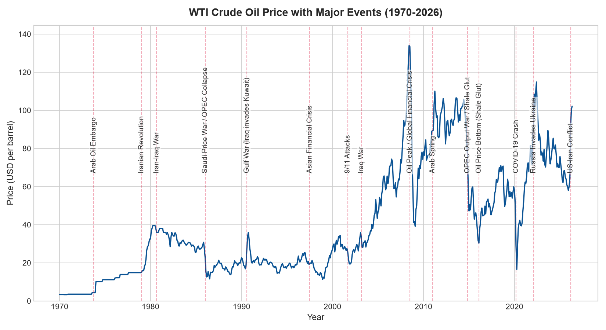
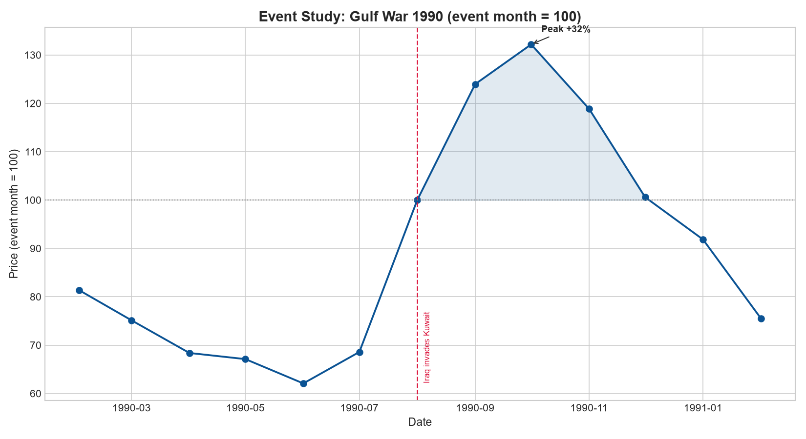
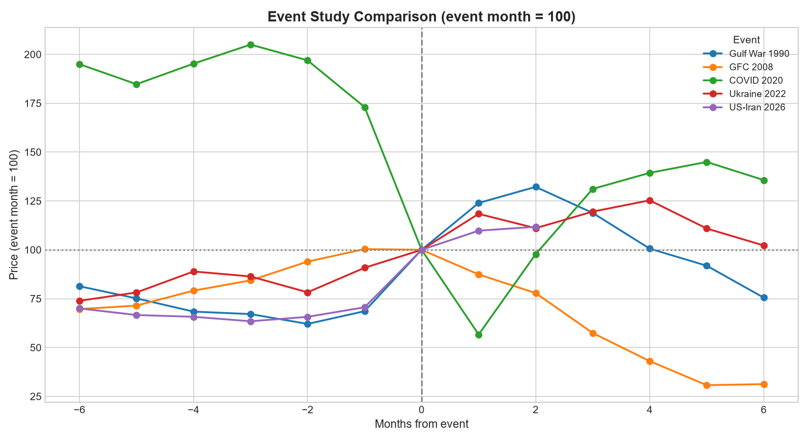
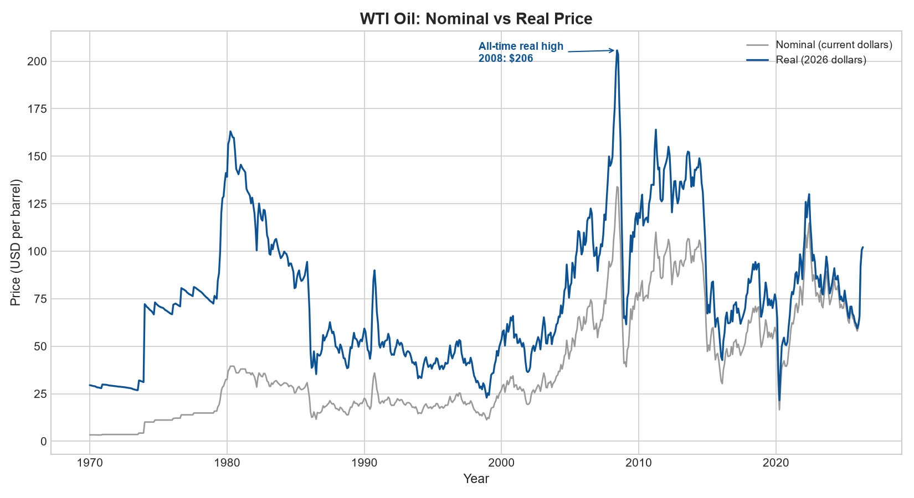
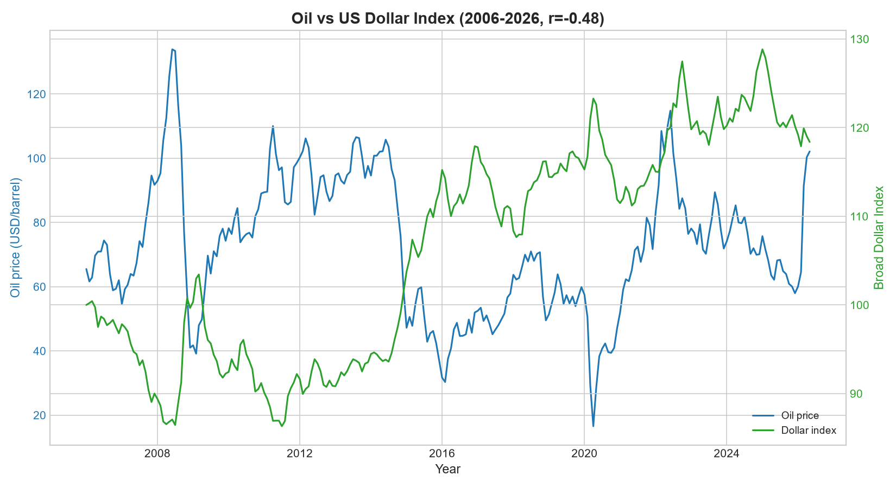
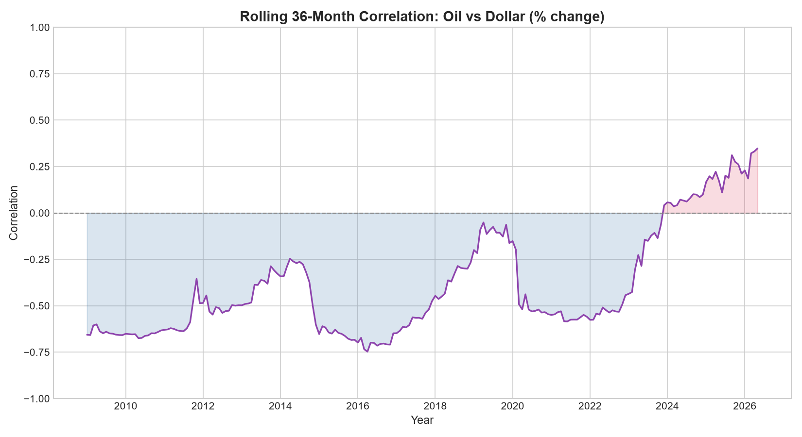
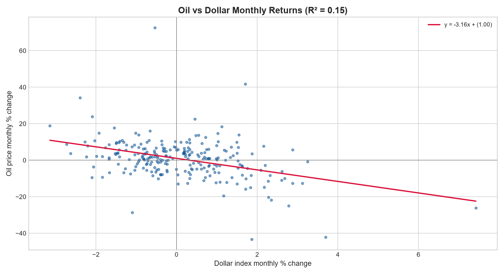
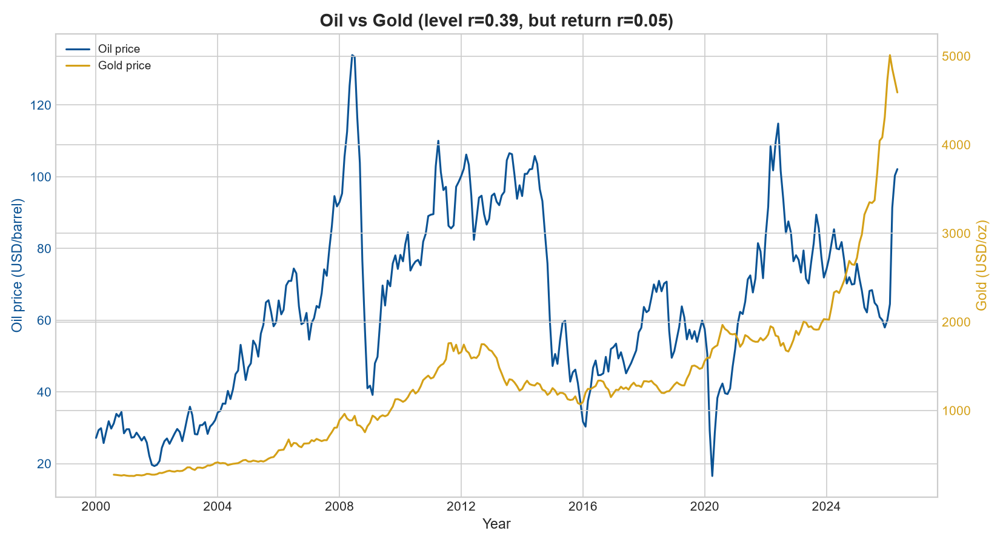
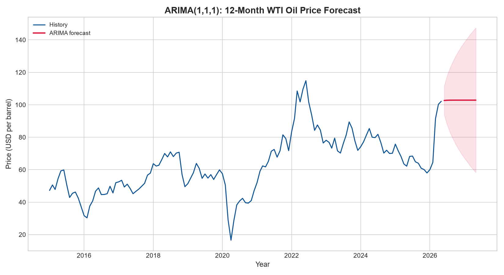

# WTI Crude Oil Prices & Global Events (1970–2026)

An exploratory data analysis of WTI crude oil prices from 1970 to 2026, framed against the
geopolitical and financial events that moved them. The underlying FRED series reaches back
to 1946; charts start in 1970 to drop the flat price-controlled era while keeping the
1973 and 1979 oil shocks, and quantitative comparisons focus on 1986 onward, after prices
 were deregulated and became comparable.

The full workflow is here: data ingestion, cleaning, transformation, inflation adjustment,
event studies, correlation analysis, and forecasting — all in Python/pandas.

---

## 1. Project Goal

Answer three questions with data:

1. **When** were the biggest price shocks, and **what** caused them?
2. Which oil price was *truly* the most expensive once inflation is stripped out?
3. How tightly does the oil price move with the **US dollar**?

---

## 2. Data

| Dataset | Series / Ticker | Provider | Frequency | Coverage |
|---|---|---|---|---|
| WTI crude oil price | `WTISPLC` | FRED | Monthly | 1946–2026 |
| Consumer Price Index | `CPIAUCSL` | FRED | Monthly | 1947–2026 |
| Broad US Dollar Index | `DTWEXBGS` | FRED | Daily → monthly | 2006–2026 |
| Gold price | `GC=F` (COMEX futures) | Yahoo Finance | Daily → monthly | 2000–2026 |
| Major events | hand-curated | — | 15 events | 1973–2026 |

### Data sources & references
- **WTI Crude Oil Price** (`WTISPLC`) — FRED, Federal Reserve Bank of St. Louis:
  https://fred.stlouisfed.org/series/WTISPLC
- **Consumer Price Index** (`CPIAUCSL`) — FRED:
  https://fred.stlouisfed.org/series/CPIAUCSL
- **Nominal Broad U.S. Dollar Index** (`DTWEXBGS`) — FRED:
  https://fred.stlouisfed.org/series/DTWEXBGS
- **Gold** (`GC=F`, COMEX gold futures) — Yahoo Finance, retrieved programmatically with the
  [`yfinance`](https://pypi.org/project/yfinance/) library: https://finance.yahoo.com/quote/GC=F
  - *Note:* FRED's LBMA gold series (`GOLDAMGBD228NLBM`) was
    [removed in January 2022](https://news.research.stlouisfed.org/2022/01/ice-benchmark-administration-ltd-iba-data-to-be-removed-from-fred/),
    so gold was sourced from Yahoo Finance instead.
- **Events** — hand-curated; dates stored in `events.csv`. Source for each event below.

#### Event references
| Date | Event | Source |
|---|---|---|
| 1973-10 | Arab Oil Embargo | [1973 oil crisis](https://en.wikipedia.org/wiki/1973_oil_crisis) |
| 1979-01 | Iranian Revolution | [Iranian Revolution](https://en.wikipedia.org/wiki/Iranian_Revolution) |
| 1980-09 | Iran-Iraq War | [Iran–Iraq War](https://en.wikipedia.org/wiki/Iran%E2%80%93Iraq_War) |
| 1986-01 | Saudi Price War / OPEC Collapse | [1980s oil glut](https://en.wikipedia.org/wiki/1980s_oil_glut) |
| 1990-08 | Gulf War (Iraq invades Kuwait) | [Gulf War](https://en.wikipedia.org/wiki/Gulf_War) |
| 1997-07 | Asian Financial Crisis | [1997 Asian financial crisis](https://en.wikipedia.org/wiki/1997_Asian_financial_crisis) |
| 2001-09 | 9/11 Attacks | [September 11 attacks](https://en.wikipedia.org/wiki/September_11_attacks) |
| 2003-03 | Iraq War | [Iraq War](https://en.wikipedia.org/wiki/Iraq_War) |
| 2008-07 | Oil Peak / Global Financial Crisis | [2008 financial crisis](https://en.wikipedia.org/wiki/2008_financial_crisis) |
| 2011-01 | Arab Spring | [Arab Spring](https://en.wikipedia.org/wiki/Arab_Spring) |
| 2014-11 | OPEC Output War / Shale Glut | [2010s oil glut](https://en.wikipedia.org/wiki/2010s_oil_glut) |
| 2016-02 | Oil Price Bottom (Shale Glut) | [2010s oil glut](https://en.wikipedia.org/wiki/2010s_oil_glut) |
| 2020-03 | COVID-19 Crash | [2020 Russia–Saudi Arabia oil price war](https://en.wikipedia.org/wiki/2020_Russia%E2%80%93Saudi_Arabia_oil_price_war) |
| 2022-02 | Russia Invades Ukraine | [Russian invasion of Ukraine](https://en.wikipedia.org/wiki/Russian_invasion_of_Ukraine) |
| 2026-03 | US-Iran Conflict | [2026 Iran war](https://en.wikipedia.org/wiki/2026_Iran_war) |

**Cleaning & prep:** parsed dates, coerced numerics, forward-filled one missing CPI month,
set a datetime index, resampled the daily dollar index and gold to monthly, and merged
everything on the date index.

**Scope decisions (methodology):**
- Charts start at **1970** to drop the flat price-controlled era while keeping the 1973/1979 oil shocks.
- Quantitative comparisons focus on **1986+**, after prices were deregulated and comparable.

---

## 3. Methodology

- **Volatility ranking** — monthly `% change` (`pct_change`), then ranked by absolute move.
- **Automatic event matching** — `merge_asof` pairs each large monthly move with the nearest
  event within a 180-day window (matched 9 of the top 10 moves).
- **Event study** — indexed prices to 100 at the event month and compared a ±6-month window
  across five crises on a common axis.
- **Real vs. nominal** — converted every month to 2026 dollars via `price × (CPI_latest / CPI_month)`.
- **Dollar correlation** — Pearson correlation on both price levels and monthly returns,
  plus a **36-month rolling correlation** to test whether the relationship is stable over time.
- **Linear regression** — least-squares fit of oil monthly returns on dollar monthly returns
  (`numpy.polyfit`) to quantify the sensitivity (slope) and explanatory power (R²).
- **Time-series forecasting** — an `ARIMA(1,1,1)` model (`statsmodels`) fit on 1986+ monthly
  prices, forecasting 12 months ahead with 95% confidence intervals. A Prophet model was wired in
  for comparison and guarded with a fallback (see Limitations).

---

## 4. Key Findings

### Biggest monthly moves (and their triggers)
| Date | Move | Event |
|---|---:|---|
| 1974-01 | **+134.6%** | Arab Oil Embargo |
| 2020-05 | +72.6% | COVID-19 rebound |
| 1990-08 | +45.8% | Gulf War (Iraq invades Kuwait) |
| 2020-04 | −43.3% | COVID-19 crash |
| 2008-12 | −28.6% | Global Financial Crisis |



### Event studies: supply shocks spike and reverse, demand shocks just fall
Indexing each crisis to 100 at its event month puts all five on a common axis, and the shapes
separate into two families. The geopolitical supply shocks give most of the move back: the 1990
Gulf War peaked at **+32%** two months in and was already **below its starting level** by month
six, and Ukraine 2022 peaked at +25% and retraced to about +2%. The 2008 demand shock does the
opposite — it falls monotonically to roughly **−70%** and never turns. COVID-19 is a third shape
again, a **−44%** collapse in one month followed by a rebound past where it started.

*(US-Iran 2026 has only two months of data after the event, so its line stops early.)*





### The most expensive oil in history was 2008 — not the 1970s
Adjusted for inflation, **June 2008 peaked at ~$206 (2026 dollars)** — the highest real
price on record. In fact, the **entire top 5 real prices all fall in 2008**. Nominal prices
badly mislead across decades: only real (inflation-adjusted) prices are a fair yardstick.



### Oil and the dollar move inversely — but the link is moderate
| Method | Correlation |
|---|---:|
| Price levels | **−0.476** |
| Monthly % change (more robust) | **−0.393** |

Both are negative, confirming the classic dollar-denominated logic (a stronger dollar makes
oil more expensive abroad, dampening demand). The relationship weakens when measured on
returns, showing that part of the level correlation is a spurious artifact of two trending
series — and that supply and geopolitical shocks, not the dollar, remain the dominant drivers.



### The oil–dollar relationship is not stable — it recently flipped positive
A 36-month rolling correlation shows the link is regime-dependent, not fixed. It sat firmly
negative (around −0.5 to −0.75) through most of 2009–2022, but **turned positive in 2023–24
for the first time** — a genuine regime shift. The 2022 combination of aggressive Fed rate
hikes and the Ukraine war pushed oil *and* the dollar up together, breaking the textbook
inverse pattern. Takeaway: a single headline correlation hides large, economically meaningful
swings — the rolling view is what tells the real story.



### Regression: a strong *direction*, but weak *explanatory power*
Regressing oil monthly returns on dollar monthly returns gives:

> **oil % ≈ −3.16 × dollar % + 1.00**, with **R² = 0.15**

A 1% rise in the dollar is associated with a ~**3.2% drop** in oil — a steep, leveraged inverse
move. Yet the dollar explains only **15% of oil's monthly variance**; the other 85% comes from
supply, geopolitics, and demand. The honest takeaway: the dollar is a real driver of *direction*
but a minor one for *magnitude* — exactly what the moderate correlation already hinted.



### Gold vs oil: a textbook case of spurious correlation
On price *levels*, oil and gold look moderately linked (**r = +0.39**). But on monthly *returns*
the correlation collapses to **+0.05 — essentially zero**. Both assets drift upward over
2000–2026 (both hedge inflation and a debasing dollar), and that shared trend manufactures the
level correlation. Month to month, they move independently. This is the clearest reminder in the
project: **always confirm a level correlation on returns before believing it** — a trend can
fabricate a relationship that isn't there.

*(Data note: gold's monthly series is built from daily `GC=F` closes averaged per month; the
daily→monthly aggregation avoids the ~15% of missing months in Yahoo's monthly feed without
inventing any values through interpolation.)*



### Forecasting: the honest answer is "≈ where it is now, with wide error bars"
An `ARIMA(1,1,1)` model forecasts the next 12 months as an almost **flat line near ~$103** —
because oil prices behave close to a **random walk**, where the best guess for next month is
roughly this month. The point forecast is therefore not the takeaway; the **95% confidence
interval, which fans out steadily the further ahead we look**, is. The honest conclusion:
short-horizon oil prices are effectively unpredictable in level, and a credible model
communicates *uncertainty* rather than a false-precision number.



---

## 5. Limitations

- **Event anchoring is inconsistent** — some events are marked at their *onset* (Gulf War),
  others at a *price peak* (2008), which affects event-study alignment.
- **Dollar data starts in 2006**, so the correlation reflects only the modern period; 2022
  (Fed hikes + Ukraine war) pushed oil and the dollar *up together*, weakening the classic link.
- Monthly data smooths intramonth spikes (e.g., the April 2020 negative-price episode).
- **Prophet did not run** — its Stan backend failed to load on this Windows environment
  (`STATUS_ENTRYPOINT_NOT_FOUND`, a bundled-DLL conflict that also broke a trivial 24-point test,
  confirming it is environmental, not data-related). The code is guarded with a `try/except` so
  the script still produces the ARIMA forecast; the Prophet overlay appears automatically on any
  machine where its backend loads.

---

## 6. How to Run

```bash
python -m venv .venv
.\.venv\Scripts\python.exe -m pip install -r requirements.txt
.\.venv\Scripts\python.exe fetch_and_explore.py
```

Writes nine figures into [`figures/`](figures): the annotated price panorama, single and
multi-event studies, nominal-vs-real prices, the oil-vs-dollar overlay, rolling correlation,
the regression scatter, the oil-vs-gold overlay, and the ARIMA forecast. They are committed to
the repository, so every chart above is visible without installing anything.

### Notebook

For a narrated, figure-by-figure walkthrough, open **[`oil_analysis.ipynb`](oil_analysis.ipynb)** —
the same analysis reorganized into explained sections with all charts rendered inline (viewable
on GitHub without running anything).
